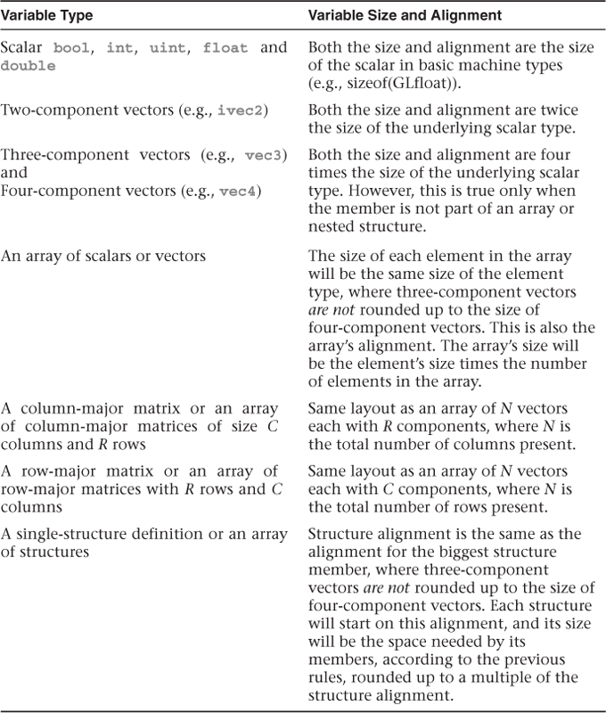

# OpenGL 路径追踪 -- 附录 1：std430 layout



在GLSL 4.30版本之后，OpenGL加入了std430 layout，允许我们以更紧凑的方式布局内存。在进行CPU与GPU的数据交换时，数据的对齐是非常重要的。根据需求，我们需要将一系列的由结构体构成的数组在CPU打包之后上传至GPU。以一个简单的三角形图元为例，我们通常以这样的方式定义:

```glsl
struct Triangle
{
    vec3 p1;
    vec3 p2;
    vec3 p3;
    vec3 normal;
    int materialID;
};
```

首先这是一个结构体，根据std430的规定，结构体的对齐是结构体中最大成员的对齐。这个结构体中最大成员是`vec3`，`vec3`的对齐为四个`GLfloat`，也就是16字节。因此这个结构体的大小将会是16字节的整数倍。前四个成员都是`vec3`，因此实际占用空间为64字节，其中包含了4个4字节大小的填充，分别将每个`vec3`对齐至16字节。再看最后一个成员，`int`类型的`materialID`，那么这个`int`也需要对齐至16字节吗？在这里并不是。std430允许将一个占用四字节的成员填补到`vec3`留下的空位中，因此实际上`normal`和`materialID`共同使用16字节空间。最终这个结构体将占用共计64字节的空间，其中包括12个字节的填充。在CPU端等价的声明类似于:

```c++
struct alignas(16) Triangle
{
    vec3 p1; float pad1; // float只是示意，表示四个字节空间
    vec3 p2; float pad2;
    vec3 p3; float pad3;
    vec3 normal;
    int materialID;
};
```

需要注意的是，假如我们以这种方式声明GPU端的三角形图元:

```glsl
struct Triangle
{
    int materialID;
    vec3 p1;
    vec3 p2;
    vec3 p3;
    vec3 normal;
};
```

这将产生完全不同的结果。此时结构体仍然要求对齐至16字节。第一个成员为`int`，将占用前4个字节。第二个成员是`vec3`，对齐要求为16字节，这要求`vec3`的地址必须从16字节的整数倍开始，因此第二个成员`p1`并不会紧跟着`materialID`，而是会产生12个字节的填充，从第17字节开始。形象的表示成如下：

```markdown
XXXX ---- ---- ---- YYYY YYYY YYYY ----
|       16         |        16        |
```

其中 "X" 表示`int`占用的空间，"-" 表示没有被使用的空间，"Y" 表示`vec3`使用的空间。这样一个`int`与一个`vec3`占用了32字节空间，造成大量的浪费，总的结构体空间也变成了80字节。因此在声明结构体时，需要注意变量的声明顺序。