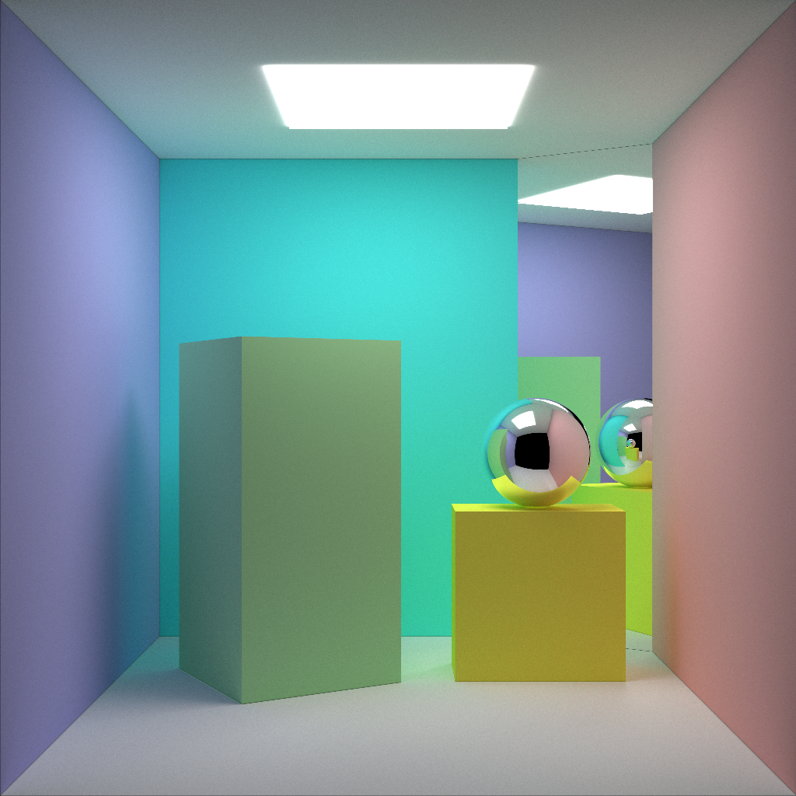

# OpenGL 路径追踪 -- Part 1：简单路径追踪初步



## 一、前言

在上一章中，我们搭建了我们进行路径追踪的基本框架，并输出了一张使用计算着色器的Hello World图片。在这一章中，我们将在这个框架基础上继续工作，尝试使用简单的路径追踪渲染出这张封面图片。


## 场景的构建

首先我们需要引入”Primitive“的概念，方便起见，在这里我称之为图元。图元是渲染管线中最基本可求交的对象。它包含了物体的几何信息，以及渲染所需要的额外信息，例如材质等属性。最简单的三角形图元定义如下 :

```c++
struct Triangle
{
	vec3 p1; // 三个顶点
    vec3 p2;
    vec3 p3;
    vec3 normal;    // 外法线
    int materialID; // 材质ID
};
```

前三个`vec3`描述了三角形在空间中的位置，即几何信息；`normal`与`materialID`描述了渲染所需的额外信息。同时我们还需要为这个类编写一个与光线求交的函数。

图元可以有很多种，例如可以是一个球，Bezier曲面，等等。只要存在对应的与光线求交函数，我们便可以在路径追踪中将这个图元绘制出来。

路径追踪的整个场景是由一个个图元构成的。通过在视平面上发射的光线，与图元求交，最终获得一个像素的颜色信息。以封面展示的场景作为例子，这是一个由一系列图元构成的场景，其中主要是三角形图元，也有球形图元。每两个三角形图元便可以表示一个矩形，上下左右、背景与光源都是这样的矩形构成，每个都使用了不同的材质，以呈现出不同的颜色，以及展现出发光的效果。用六个矩形就可以拼成一个长方体。球也作为一个图元加入在场景中。场景中的光源、颜色、镜面效果都是由图元的材质ID所对应的材质产生的。


